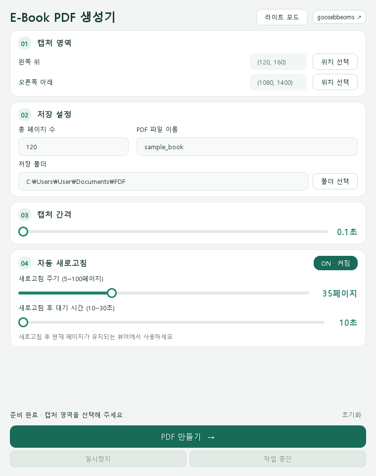
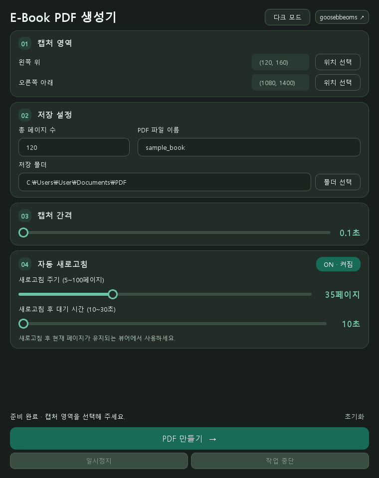

# eBookToPdf · PDF Studio

전자책 화면의 원하는 영역을 연속 캡처하고 **하나의 PDF로 저장하는 Windows용 GUI 프로그램**입니다.

캡처 영역과 페이지 수를 지정하면 오른쪽 방향키로 페이지를 넘기며 저장합니다. 자동 새로고침, 일시정지·재개, 저장 폴더 선택, 라이트·다크 모드를 지원합니다.

## 화면 미리보기

아래 이미지는 현재 프로그램을 렌더링한 화면입니다. 좌표·파일 이름·저장 폴더는 사용 예시입니다.

| 라이트 모드 | 다크 모드 |
| --- | --- |
|  |  |

이미지를 클릭하면 크게 볼 수 있습니다. 창이 작으면 설정 영역을 스크롤할 수 있으며, **일시정지·작업 중단 버튼은 하단에 고정**됩니다.

## 1. 설치하고 실행하기

### 실행 파일을 받은 경우

1. 배포받은 ZIP 파일을 압축 해제합니다.
2. `eBookToPdf.exe`를 실행합니다.
3. 실행 파일과 함께 `_internal` 폴더가 있다면 같은 위치에 그대로 두세요. 실행 파일만 따로 옮기면 실행되지 않을 수 있습니다.

이 방법은 Python을 별도로 설치하지 않아도 됩니다. 실행 파일 배포본이 없다면 아래 소스 실행 방법을 사용하세요.

### Python 소스로 실행하는 경우

Windows에 Python 3가 설치되어 있어야 합니다.

1. GitHub의 **Code → Download ZIP**으로 소스를 내려받고 압축을 풉니다.
2. `eBookToPdf.py`가 있는 폴더에서 PowerShell 또는 터미널을 엽니다.
3. 아래 명령을 차례로 실행합니다.

```powershell
# 프로젝트 전용 Python 환경 생성
py -m venv .venv

# 필요한 라이브러리 설치
.\.venv\Scripts\python.exe -m pip install PySide6 mss pynput Pillow

# 프로그램 실행
.\.venv\Scripts\python.exe eBookToPdf.py
```

`py` 명령을 찾을 수 없지만 `python --version`이 정상적으로 실행된다면 첫 번째 명령을 `python -m venv .venv`로 바꾸세요. 다음 실행부터는 마지막 실행 명령만 입력하면 됩니다.

## 2. 첫 PDF 만들기

### 먼저 전자책 화면 준비하기

- 저장을 시작할 페이지를 브라우저 또는 뷰어에 엽니다.
- **오른쪽 방향키 한 번으로 다음 화면으로 넘어가는지** 확인한 뒤 시작 페이지로 돌아옵니다.
- 전자책 창의 위치, 크기, 확대 비율을 맞춥니다. 캡처 도중에는 바꾸지 마세요.
- 처음에는 **2~3페이지만 시험 저장**해 영역과 넘김 속도가 맞는지 확인하면 좋습니다.

### ① 캡처 영역 지정

**01 캡처 영역**에서 다음 순서로 지정합니다.

1. `왼쪽 위` 옆의 **위치 선택**을 누릅니다.
2. 전자책에서 저장할 영역의 왼쪽 위 모서리를 클릭합니다.
3. `오른쪽 아래` 옆의 **위치 선택**을 누릅니다.
4. 같은 영역의 오른쪽 아래 모서리를 클릭합니다.

지정한 좌표가 화면에 표시됩니다. 오른쪽 아래 좌표는 왼쪽 위보다 오른쪽·아래에 있어야 합니다. 위치 선택 후에는 화면의 다음 클릭을 기다리므로 원하는 모서리를 클릭하면 됩니다.

### ② 페이지 수·파일 이름·저장 폴더 설정

**02 저장 설정**에서 입력합니다.

| 항목 | 입력 예시 | 설명 |
| --- | --- | --- |
| 총 페이지 수 | `120` | 현재 화면부터 캡처할 화면 수입니다. 책에 표시된 마지막 페이지 번호가 아닙니다. |
| PDF 파일 이름 | `sample_book` | `.pdf` 확장자는 자동으로 붙습니다. 이미 입력한 경우 중복으로 붙지 않습니다. |
| 저장 폴더 | **폴더 선택**으로 지정 | PDF를 저장할 폴더를 선택합니다. 기본값은 프로그램 실행 시 작업 폴더입니다. |

**한 번 캡처한 화면이 PDF 한 페이지**가 됩니다. 뷰어가 두 쪽 보기라면 책의 두 쪽이 PDF 한 페이지에 함께 들어갑니다.

같은 폴더에 같은 이름의 PDF가 있으면 **완료 시 기존 파일을 덮어씁니다.** 이전 결과를 남기려면 새 이름을 입력하세요. 파일 이름에 `\ / : * ? " < > |` 문자는 사용할 수 없습니다.

### ③ 캡처 간격 설정

**03 캡처 간격** 슬라이더로 다음 화면을 캡처하기 전 대기 시간을 조절합니다.

- 설정 범위: **0.1~5.0초**, 기본 **0.1초**
- 화면이 늦게 나타나거나 페이지 전환 애니메이션이 있다면 간격을 늘려 주세요.
- 처음 시험할 때는 1초 정도로 시작하고, 저장 결과를 확인하면서 조절할 수 있습니다.

### ④ 자동 새로고침 설정

**04 자동 새로고침**은 연속 캡처 중 뷰어가 느려질 때 사용할 수 있습니다.

| 설정 | 기본값 | 조절 범위·동작 |
| --- | --- | --- |
| 자동 새로고침 | **ON** | OFF로 바꾸면 새로고침 없이 계속 캡처합니다. |
| 새로고침 주기 | **35페이지** | 5~100페이지, 1페이지 단위 |
| 새로고침 후 대기 시간 | **10초** | 10~30초 |

예를 들어 총 80페이지를 기본 설정으로 캡처하면 **35페이지 캡처 → F5 → 10초 대기 → 다음 페이지 진행**, **70페이지에서 다시 새로고침**, **80페이지에서 종료**합니다. 캡처 결과는 모두 하나의 PDF에 저장됩니다.

- 마지막 캡처 후에는 새로고침하지 않습니다. 총 35페이지라면 기본 설정에서 새로고침은 발생하지 않습니다.
- OFF로 바꾸면 관련 슬라이더가 비활성화됩니다. 다시 ON으로 바꾸면 선택한 값이 유지됩니다.
- **새로고침 후에도 현재 페이지가 유지되는 뷰어에서만 ON으로 사용하세요.** 처음 페이지로 돌아가거나 로그인이 풀리는 뷰어라면 OFF로 사용하세요.

### ⑤ PDF 만들기

1. **PDF 만들기 →**를 누릅니다.
2. **3초의 준비 시간 동안 전자책 창으로 전환**하고 캡처 영역이 가려지지 않도록 합니다.
3. 프로그램이 지정 영역을 캡처하고 오른쪽 방향키로 페이지를 넘깁니다.
4. 모든 화면을 캡처하면 PDF로 변환하여 선택한 폴더에 저장합니다.
5. 하단의 저장 완료 메시지와 저장 경로를 확인합니다. 완료 시 Windows 알림도 요청합니다.

실행 중에는 다른 창을 전자책 위에 올리거나 브라우저 창을 이동·최소화하지 마세요. 화면에 실제로 보이는 내용을 캡처하므로 화면 잠금이나 다른 작업은 결과에 영향을 줄 수 있습니다.

## 3. 일시정지·재개·중단

| 버튼 | 동작 |
| --- | --- |
| **일시정지** | 캡처 또는 변환을 처리 가능한 지점에서 멈춥니다. 진행 위치와 남은 대기 시간을 유지합니다. |
| **재개** | 멈춘 작업을 이어갑니다. 캡처 단계에서는 전자책으로 전환할 3초의 준비 시간이 주어집니다. |
| **작업 중단** | 이번 작업을 취소하고 임시 캡처와 미완성 PDF를 정리합니다. 중단한 작업을 이어서 재개할 수는 없습니다. |

일시정지 요청 후 하단의 **일시정지됨** 상태를 확인하세요. 일시정지 중에는 전자책 페이지와 창 위치를 변경하지 마세요. 재개 후에도 같은 영역과 페이지 순서를 사용합니다.

작업 중단 시 **현재까지의 캡처를 부분 PDF로 저장하지 않습니다.** 최종 저장 전에 취소하면 같은 이름으로 존재하던 기존 PDF는 유지됩니다. 작업 중 창을 닫아도 중단과 정리 후 종료합니다.

작업 중에는 설정 변경과 중복 실행을 막기 위해 일부 입력란이 비활성화됩니다. 정리가 끝나면 다시 설정하고 새 작업을 시작할 수 있습니다.

## 4. 화면 모드·완료 알림

- 상단 **라이트 모드 / 다크 모드** 버튼으로 화면 색상을 전환합니다.
- 옆의 **goosebbeoms ↗** 버튼은 개발자 GitHub 프로필을 기본 브라우저로 엽니다.
- PDF 저장 성공 시 Windows 알림을 표시하도록 요청합니다. 알림 기능을 지원하지 않는 환경에서는 완료 창을 표시합니다.
- Windows 알림 설정이나 방해 금지 모드에 따라 알림이 보이지 않을 수 있습니다. 이 경우 프로그램 하단의 저장 완료 메시지를 확인하세요.
- **초기화**는 캡처 좌표·페이지 수·파일 이름을 지우고 캡처 간격 0.1초, 새로고침 ON·35페이지·10초로 되돌립니다. 선택한 저장 폴더와 화면 모드는 유지됩니다.
- 설정을 파일로 저장하는 기능은 없으므로 프로그램을 다시 실행하면 기본 설정으로 시작합니다.

## 5. 자주 겪는 문제

| 증상 | 확인할 내용 |
| --- | --- |
| 같은 화면이 계속 저장돼요. | 전자책 창에 입력 초점이 있는지, 오른쪽 방향키로 페이지가 넘어가는지 확인하세요. 팝업이나 입력란이 키 입력을 가로막고 있을 수 있습니다. |
| 빈 화면이나 전환 중인 화면이 저장돼요. | 캡처 간격을 늘리세요. 새로고침 직후라면 새로고침 대기 시간을 최대 30초까지 늘려 보세요. |
| 새로고침 후 다른 페이지가 나와요. | 자동 새로고침을 OFF로 설정하세요. 프로그램은 뷰어 내부 페이지 번호를 읽거나 복원하지 않습니다. |
| 캡처 영역이 어긋나요. | 창 위치·크기·확대 비율·모니터 배율을 확인하고 두 모서리를 다시 지정하세요. |
| 페이지 수를 어떻게 입력해야 하나요? | 시작 화면을 포함하여 저장할 **화면 수**를 입력하세요. 1을 입력하면 현재 화면만 저장합니다. |
| 저장 오류가 나요. | 저장 폴더의 존재 여부·쓰기 권한·여유 공간을 확인하세요. 기존 PDF가 다른 프로그램에서 열려 있으면 닫고 다시 시도하세요. |
| 중단 버튼을 눌렀는데 바로 끝나지 않아요. | 처리 중인 이미지나 파일 쓰기가 취소 확인 지점에 도달한 뒤 임시 파일을 정리합니다. 하단 상태가 바뀔 때까지 기다리세요. |
| `ModuleNotFoundError`가 나와요. | 설치에 사용한 가상 환경으로 실행하는지 확인하고 위 라이브러리 설치 명령을 다시 실행하세요. |

## 개발 및 테스트

주요 라이브러리는 **PySide6**(GUI), **mss**(화면 캡처), **pynput**(마우스·키보드 제어), **Pillow**(이미지·PDF 저장)입니다.

```text
eBookToPdf.py              # 프로그램
favicon.ico               # 아이콘
test_capture_controls.py  # 캡처 제어 테스트
README.md                 # 사용 설명
docs/images/              # README에 포함된 GUI 이미지
```

프로젝트 폴더에서 다음 명령으로 테스트를 실행할 수 있습니다.

```powershell
.\.venv\Scripts\python.exe -m unittest test_capture_controls -v
```

테스트는 화면 캡처·마우스·키보드 입력을 모의 처리합니다. 일시정지, 취소, 새로고침 시점, PDF 저장 등을 검증하며 실제 전자책 뷰어 호환성을 보장하는 테스트는 아닙니다.

PDF는 화면 이미지로 구성됩니다. 원본 전자책의 텍스트·목차를 추출하거나 OCR을 수행하는 기능은 포함하지 않습니다.
